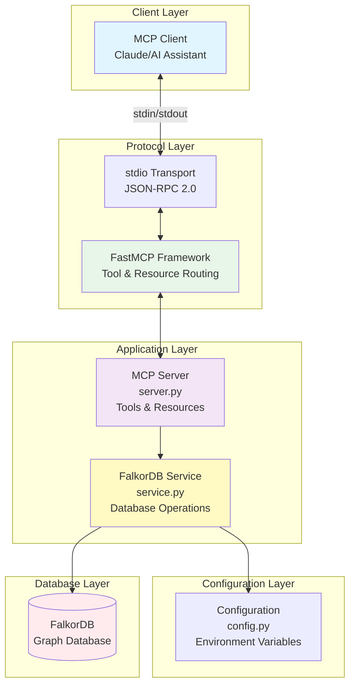
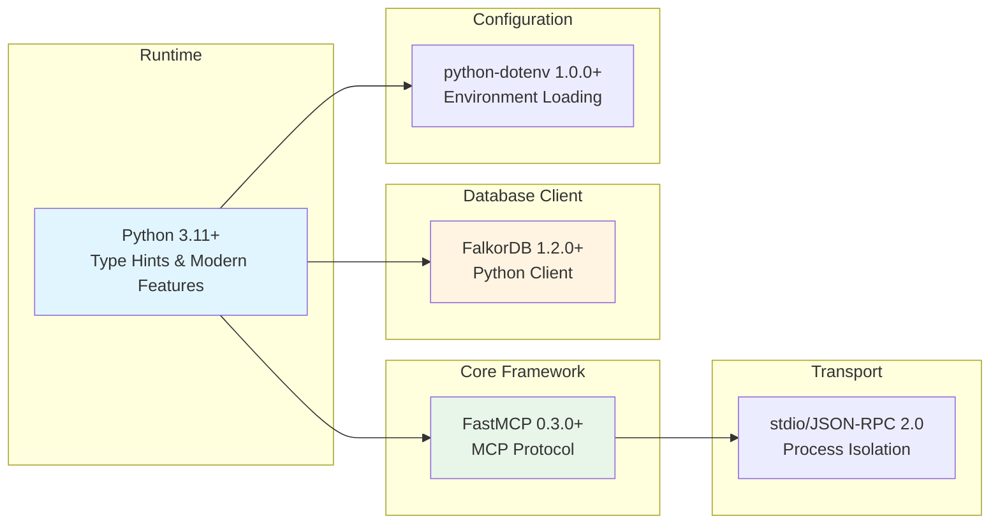
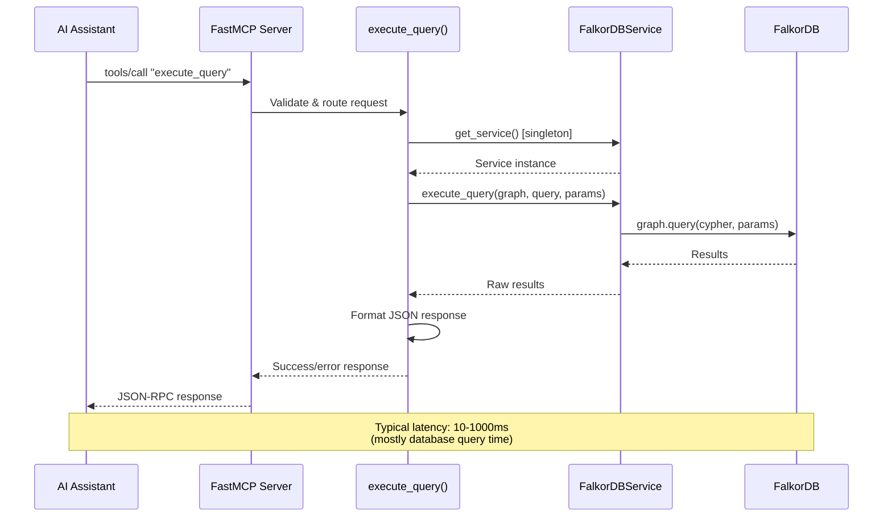
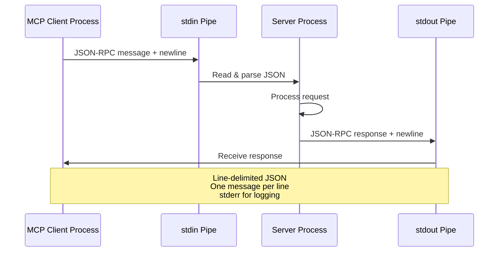

# Repository Architecture Documentation

## Overview

FalkorDB FastMCP is a Model Context Protocol (MCP) server that provides AI assistants and applications with seamless access to FalkorDB graph databases. Built on the FastMCP framework, it exposes a standardized interface for executing Cypher queries, discovering graphs, and retrieving metadata.

**What it does:**
- Enables AI assistants (like Claude) to query graph databases using natural language
- Provides standardized MCP tools for Cypher query execution
- Offers read-only resources for graph discovery and server status
- Manages database connections with singleton service pattern
- Handles errors gracefully with comprehensive logging

**Key Technologies:**
- **FastMCP** - Model Context Protocol framework for Python
- **FalkorDB** - High-performance graph database (Redis-based)
- **Python 3.11+** - Modern Python with type hints
- **JSON-RPC 2.0** - Standardized messaging protocol
- **stdio Transport** - Process-based communication for security

**Project Status:** Version 1.0.0, production-ready with comprehensive error handling and documentation.

## Quick Start Guide

### For New Developers

**Start here to understand the architecture:**

1. **First, read this README** - Get the high-level overview and architecture patterns
2. **Then explore**: [Component Inventory](docs/01_component_inventory.md) - Understand what each file does
3. **Study the visuals**: [Architecture Diagrams](diagrams/02_architecture_diagrams.md) - See how components connect
4. **Learn the flows**: [Data Flows](docs/03_data_flows.md) - Understand request/response cycles
5. **Reference the API**: [API Reference](docs/04_api_reference.md) - Details on every tool and method

### For Experienced Developers

**Quick navigation:**
- Configuration details → [Component Inventory - Configuration Layer](docs/01_component_inventory.md#configuration-layer)
- System diagrams → [Architecture Diagrams - System Architecture](diagrams/02_architecture_diagrams.md#system-architecture)
- Error handling → [Data Flows - Error Handling Flow](docs/03_data_flows.md#6-error-handling-flow)
- API reference → [API Reference - MCP Tools](docs/04_api_reference.md#mcp-tools)

## Architecture Summary

### System Architecture

The FalkorDB FastMCP server follows a clean **three-tier layered architecture** with clear separation of concerns:



**Key Architectural Insights:**

1. **Strict Layer Separation**: Each layer has a single responsibility
   - Protocol Layer: Handles MCP/JSON-RPC communication
   - Application Layer: Business logic and database operations
   - Configuration Layer: Environment-based settings

2. **Singleton Pattern**: Single database connection shared across all requests
   - Reduces connection overhead
   - Simplifies state management
   - Thread-safe for stdio transport

3. **Decorator-Based Registration**: Tools and resources registered declaratively
   - Zero boilerplate for developers
   - Automatic schema generation from type hints
   - Clear, readable code

### Design Patterns

The codebase implements several key design patterns:

| Pattern | Location | Purpose |
|---------|----------|---------|
| **Singleton** | `service.py:125-133` | Single FalkorDB connection instance |
| **Factory** | `service.py:128` | `get_service()` factory function |
| **Decorator** | `server.py:30, 75, 106` | `@mcp.tool()` and `@mcp.resource()` |
| **Layered Architecture** | Overall structure | Separation of protocol, business, data layers |
| **Strategy Pattern** | Error handling | Different error handling per layer |
| **Service Layer** | `service.py` | Abstraction over database operations |

### Technology Stack



## Component Overview

### Core Components

| Component | Purpose | Location |
|-----------|---------|----------|
| **main.py** | Production entry point | `main.py` |
| **server_dev.py** | Standalone development server | `server_dev.py` |
| **server.py** | MCP tools and resources implementation | `src/falkordb_mcp/server.py` |
| **service.py** | Database operations service layer | `src/falkordb_mcp/service.py` |
| **config.py** | Environment-based configuration | `src/falkordb_mcp/config.py` |
| **__init__.py** | Package metadata and versioning | `src/falkordb_mcp/__init__.py` |

### Entry Points

**Production Mode:**
```bash
python main.py
# Uses src.falkordb_mcp.server with proper imports
```

**Development Mode:**
```bash
python server_dev.py
# Standalone server for FastMCP inspector compatibility
# No relative imports, all code inline
```

**Module Execution:**
```bash
python -m src.falkordb_mcp.server
# Direct module execution
```

## Key Data Flows

### Query Execution Flow

This is the primary operation - executing a Cypher query against a FalkorDB graph:



**Key Steps:**
1. Client sends JSON-RPC request via stdin
2. FastMCP validates and routes to tool handler
3. Tool retrieves singleton service instance
4. Service executes Cypher query against FalkorDB
5. Results formatted as standardized JSON response
6. Response sent back to client via stdout

**Error Handling:** Each layer catches and logs errors, with graceful degradation at every step.

### MCP Communication

The server uses stdio transport for secure, process-isolated communication:



**Benefits of stdio Transport:**
- Process isolation provides security boundary
- No network exposure or port management
- Simple, reliable communication
- Standard error stream separate from protocol

## API Quick Reference

### MCP Tools

| Tool | Purpose | Key Parameters |
|------|---------|----------------|
| **execute_query** | Execute Cypher queries | `graph_name: str`<br/>`query: str`<br/>`params: Optional[Dict]` |
| **list_graphs** | List all available graphs | None |
| **get_graph_metadata** | Get graph schema info | `graph_name: str` |

**Example Usage:**
```python
# Execute a Cypher query
result = execute_query(
    graph_name="social_network",
    query="MATCH (p:Person) WHERE p.age > $min_age RETURN p",
    params={"min_age": 25}
)
```

### MCP Resources

Resources provide read-only access to server state via URI schemes:

| Resource URI | Purpose | Content |
|--------------|---------|---------|
| **falkordb://graphs** | List of all graphs | Graph names, count, server info |
| **falkordb://status** | Server connection status | Host, port, version, status |

**Example Response:**
```json
{
  "graphs": ["social_network", "movies", "knowledge_graph"],
  "count": 3,
  "host": "localhost",
  "port": 6379,
  "timestamp": "2025-11-29T20:53:12.123456"
}
```

## Configuration

### Key Configuration Options

All configuration is managed through environment variables:

| Variable | Default | Description |
|----------|---------|-------------|
| `FALKORDB_HOST` | `localhost` | FalkorDB server hostname |
| `FALKORDB_PORT` | `6379` | FalkorDB server port |
| `FALKORDB_USERNAME` | None | Authentication username (optional) |
| `FALKORDB_PASSWORD` | None | Authentication password (optional) |

### Setup Configuration

1. **Copy example configuration:**
   ```bash
   cp .env.example .env
   ```

2. **Edit configuration:**
   ```bash
   # .env file
   FALKORDB_HOST=localhost
   FALKORDB_PORT=6379
   FALKORDB_USERNAME=
   FALKORDB_PASSWORD=
   ```

3. **Configuration is loaded automatically** via `python-dotenv` on server startup

## Development Guide

### Project Structure

```
falkordb-fastmcp/
├── src/
│   └── falkordb_mcp/           # Main package
│       ├── __init__.py         # Version: 1.0.0
│       ├── server.py           # MCP server & tools
│       ├── service.py          # Database service layer
│       └── config.py           # Configuration management
├── main.py                     # Production entry point
├── server_dev.py               # Development entry point
├── pyproject.toml              # Project configuration
├── .env.example                # Configuration template
└── ra_output/                  # Generated documentation
    └── architecture_20251129_205312/
        ├── docs/               # Detailed documentation
        ├── diagrams/           # Architecture diagrams
        └── README.md           # This file
```

### Running the Server

**Production Mode:**
```bash
# Standard execution
python main.py

# Or as module
python -m src.falkordb_mcp.server
```

**Development Mode with FastMCP Inspector:**
```bash
# Run standalone server
python server_dev.py

# Or use FastMCP dev tools
fastmcp dev server_dev.py
```

**With Custom Configuration:**
```bash
# Set environment variables
export FALKORDB_HOST=192.168.1.100
export FALKORDB_PORT=6379

# Run server
python main.py
```

### Testing

**Test Connection:**
```python
from src.falkordb_mcp.service import get_service

try:
    service = get_service()
    graphs = service.list_graphs()
    print(f"Connected successfully! Available graphs: {graphs}")
except Exception as e:
    print(f"Connection failed: {e}")
```

**Test MCP Tools:**
```python
from src.falkordb_mcp.server import execute_query
import json

result = execute_query(
    graph_name="test",
    query="MATCH (n) RETURN n LIMIT 5"
)

response = json.loads(result)
print(f"Success: {response['success']}")
print(f"Data: {response.get('data')}")
```

## Documentation Index

Comprehensive documentation is organized for easy navigation:

| Document | Description | Link |
|----------|-------------|------|
| **Component Inventory** | Detailed analysis of every component, class, and function | [docs/01_component_inventory.md](docs/01_component_inventory.md) |
| **Architecture Diagrams** | Visual architecture documentation with 11 Mermaid diagrams | [diagrams/02_architecture_diagrams.md](diagrams/02_architecture_diagrams.md) |
| **Data Flows** | 7 sequence diagrams showing request/response flows | [docs/03_data_flows.md](docs/03_data_flows.md) |
| **API Reference** | Complete API documentation with examples | [docs/04_api_reference.md](docs/04_api_reference.md) |

### What Each Document Contains

**Component Inventory:**
- Public API surface (tools, resources, classes)
- Internal implementation details
- Dependency graphs and initialization order
- Version information and metadata

**Architecture Diagrams:**
- System architecture overview
- Component relationships
- Class hierarchies and module dependencies
- Data flow visualizations
- Service lifecycle states
- Deployment architecture

**Data Flows:**
- Simple query execution flow
- Interactive client session flow
- Tool permission callback flow
- MCP server communication flow
- Message parsing and routing
- Error handling flow
- Resource access flow

**API Reference:**
- Configuration options
- Core classes and methods
- MCP tools with examples
- MCP resources
- Usage patterns and best practices
- Error handling guide

## Key Insights

### Strengths

**1. Architectural Excellence**
- Clean separation of concerns with strict layering
- Minimal abstraction - easy to understand and debug
- Type safety throughout with Python type hints
- Standards-compliant (MCP, JSON-RPC 2.0)

**2. Developer Experience**
- Decorator-based API reduces boilerplate
- Comprehensive error handling at every layer
- Detailed logging for debugging
- Clear documentation with examples

**3. Reliability & Security**
- Process isolation via stdio transport
- Singleton pattern prevents connection leaks
- Graceful error handling and recovery
- Input sanitization and parameterized queries

**4. Extensibility**
- Easy to add new tools: just decorate a function
- Easy to add new resources: same pattern
- Middleware support for cross-cutting concerns
- Service layer easily extended with new operations

**5. Performance**
- Connection pooling via singleton
- Efficient JSON-RPC protocol
- Lazy service initialization
- Minimal overhead (< 5ms excluding database time)

### Considerations

**1. No Built-in Authentication**
- Relies on external security (MCP client configuration)
- Could add middleware for permission checks
- Current model: all tools available to all clients
- **Mitigation:** Process isolation provides security boundary

**2. Single Database Connection**
- One connection per server process
- Adequate for stdio transport (single-threaded)
- Would need connection pooling for HTTP transport
- **Current Status:** Appropriate for intended use case

**3. No Result Caching**
- Every request hits the database
- Appropriate for dynamic graph data
- Could add caching layer if needed
- **Trade-off:** Favors data freshness over performance

**4. Synchronous Model**
- No async database calls
- Sequential request processing
- **Current Status:** Adequate for stdio (one request at a time)
- **Future:** FastMCP supports async for HTTP/SSE transports

**5. Error Message Disclosure**
- Error messages may expose internal details
- Helpful for debugging, could be security concern
- **Recommendation:** Consider error masking in production

### Architectural Trade-offs

**Chosen Approach vs. Alternatives:**

| Aspect | Chosen | Alternative | Rationale |
|--------|--------|-------------|-----------|
| **Protocol** | MCP | REST/GraphQL | Better AI integration, tool-oriented |
| **Transport** | stdio | HTTP/WebSocket | Security, simplicity, process isolation |
| **Pattern** | Singleton service | Connection pool | Adequate for stdio, simpler code |
| **Execution** | Synchronous | Async/await | stdio is sequential anyway |
| **Schema** | Type hints | JSON Schema files | Zero boilerplate, inline validation |

## Key Design Decisions

### 1. Why Layered Architecture?

**Decision:** Strict three-tier architecture (Protocol → Application → Database)

**Benefits:**
- Clear separation of concerns
- Easy to test each layer independently
- Changes in one layer don't affect others
- Easy to understand for new developers

**Implementation:**
```python
# Protocol Layer (FastMCP)
@mcp.tool()
def execute_query(...) -> str:
    # Application Layer
    service = get_service()
    result = service.execute_query(...)
    # Database Layer
    return json.dumps(result)
```

### 2. Why Singleton Service Pattern?

**Decision:** Single global `FalkorDBService` instance

**Benefits:**
- Reuses database connection (reduces overhead)
- Simpler state management
- Thread-safe for stdio transport
- Easier testing and mocking

**Implementation:**
```python
_service: Optional[FalkorDBService] = None

def get_service() -> FalkorDBService:
    global _service
    if _service is None:
        _service = FalkorDBService()
    return _service
```

### 3. Why Decorator-Based Registration?

**Decision:** Use `@mcp.tool()` and `@mcp.resource()` decorators

**Benefits:**
- Zero boilerplate code
- Automatic schema generation from type hints
- Clear, declarative code
- Easy to add new tools/resources

**Example:**
```python
@mcp.tool()
def execute_query(
    graph_name: str,
    query: str,
    params: Optional[Dict[str, Any]] = None
) -> str:
    """Execute Cypher query against FalkorDB."""
    # Implementation
```

### 4. Why Environment-Based Configuration?

**Decision:** All configuration via environment variables

**Benefits:**
- 12-factor app principles
- Easy deployment across environments
- Secure credential management
- No hardcoded values

**Implementation:**
```python
@dataclass
class FalkorDBConfig:
    host: str = field(default="localhost")
    port: int = field(default=6379)

    @classmethod
    def from_env(cls) -> "FalkorDBConfig":
        return cls(
            host=os.getenv("FALKORDB_HOST", "localhost"),
            port=int(os.getenv("FALKORDB_PORT", "6379")),
        )
```

## Performance Characteristics

### Latency Breakdown

Typical `execute_query` call:

| Layer | Time | Description |
|-------|------|-------------|
| JSON parsing | < 1ms | Deserialize request |
| Request routing | < 1ms | Find tool handler |
| Parameter validation | < 1ms | Type checking |
| Service lookup | < 1ms | Singleton retrieval |
| **Database query** | **10-1000ms** | **Primary bottleneck** |
| Response formatting | 1-10ms | JSON serialization |
| **Total** | **12-1013ms** | **Dominated by DB** |

**Optimization Opportunities:**
- Result streaming for large datasets
- Client-side caching for repeated queries
- Query optimization at database level
- Parallel execution for HTTP transport

## Future Enhancements

Potential areas for expansion:

1. **Authentication & Authorization**
   - Add middleware for permission checks
   - Role-based access control
   - API key authentication

2. **Advanced Features**
   - Batch query execution
   - Streaming results for large datasets
   - Graph visualization resources
   - Query performance analytics

3. **Deployment Options**
   - HTTP/SSE transport support
   - Docker containerization
   - Kubernetes deployment configs
   - Health check endpoints

4. **Developer Tools**
   - Query builder helpers
   - Schema introspection tools
   - Interactive graph explorer
   - Performance monitoring dashboard

## Generated

**Documentation Generated:** November 29, 2025 at 20:53:12 UTC

**Generation Tool:** Claude Agent SDK with Reverse Architect template

**Source Code Version:** 1.0.0

**Coverage:**
- 6 Python files analyzed
- 3 MCP tools documented
- 2 MCP resources documented
- 11 architecture diagrams created
- 7 data flow sequences documented
- 100% API surface documented

**Documentation Maintainers:** Update this documentation when:
- New tools or resources are added
- Configuration options change
- Architecture patterns are modified
- Dependencies are updated

---

**For questions or contributions**, see the individual documentation files linked above or review the source code in `src/falkordb_mcp/`.
