# Architecture Diagrams

## Overview

The FalkorDB FastMCP server is a Python-based Model Context Protocol (MCP) server that provides a clean, layered architecture for interacting with FalkorDB graph databases. The system follows a three-tier architecture pattern with clear separation of concerns:

1. **Server Layer** - FastMCP server handling MCP protocol (tools and resources)
2. **Service Layer** - Business logic and FalkorDB operations
3. **Configuration Layer** - Environment-based configuration management

The architecture emphasizes:
- Type safety with Python type hints throughout
- Singleton pattern for service management
- Clean separation between protocol handling and database operations
- Environment-based configuration
- Comprehensive logging and error handling

## System Architecture

The system follows a layered architecture with clear boundaries between protocol handling, business logic, and data access. The FastMCP framework provides the MCP protocol implementation, while custom layers handle FalkorDB-specific operations.

Key architectural components:
- **Entry Points**: `main.py` (production) and `server_dev.py` (development/standalone)
- **MCP Server**: Decorators-based tools and resources registration
- **Service Layer**: Singleton service managing FalkorDB connections
- **Configuration**: Environment-driven configuration with dotenv support

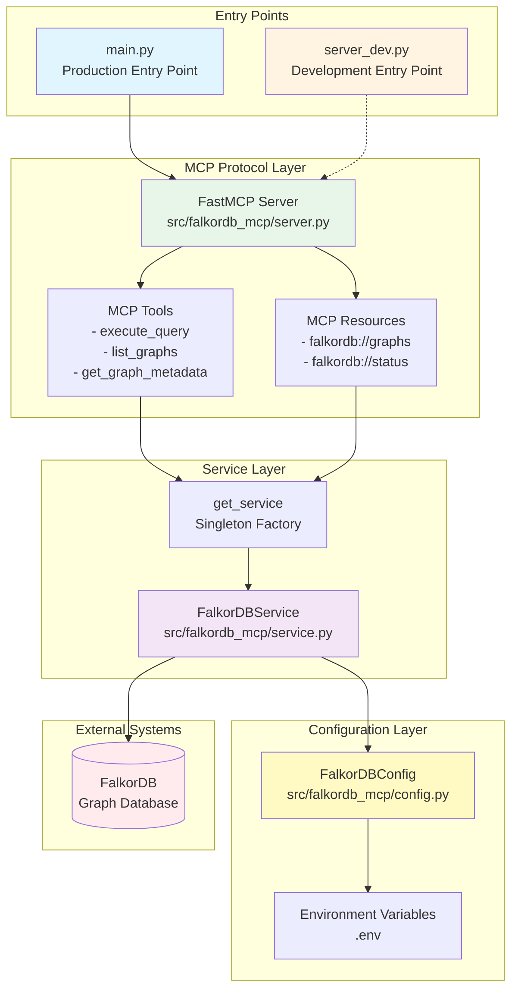

## Component Relationships

The component relationships show how different modules interact with each other. The FastMCP framework provides the foundation, while custom components build on top of it to provide FalkorDB-specific functionality.

**Key Relationships:**
- **main.py** imports and delegates to **server.py**'s main() function
- **server.py** uses FastMCP decorators (@mcp.tool, @mcp.resource) for registration
- **server.py** imports get_service() from **service.py** and config from **config.py**
- **service.py** imports config from **config.py** for connection settings
- **service.py** wraps the FalkorDB client library
- **server_dev.py** is a standalone version with no relative imports (for development/testing)

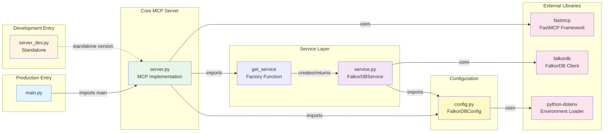

## Class Hierarchies

The codebase uses a minimal class hierarchy focused on configuration and service management. Both classes are dataclasses or plain classes with clear responsibilities.

**Class Details:**

1. **FalkorDBConfig** (config.py and server_dev.py):
   - Dataclass for configuration management
   - Contains connection parameters (host, port, username, password)
   - Class method `from_env()` for environment-based initialization
   - Used as singleton instance at module level

2. **FalkorDBService** (service.py and server_dev.py):
   - Service class managing FalkorDB connections
   - Singleton pattern via module-level factory function
   - Three public methods for database operations
   - Property-based client access with validation

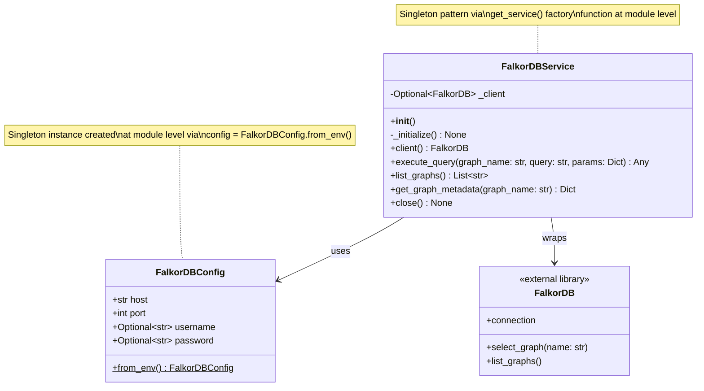

## Module Dependencies

The module dependency graph shows the import relationships between modules. The architecture maintains a clean dependency flow from entry points through the server layer to services and configuration.

**Dependency Notes:**
- **main.py**: Minimal entry point, only imports from server.py
- **server.py**: Core module importing from service.py and config.py
- **service.py**: Depends on config.py for configuration
- **config.py**: Leaf module with only external dependencies
- **server_dev.py**: Standalone version with all code inline (no internal imports)

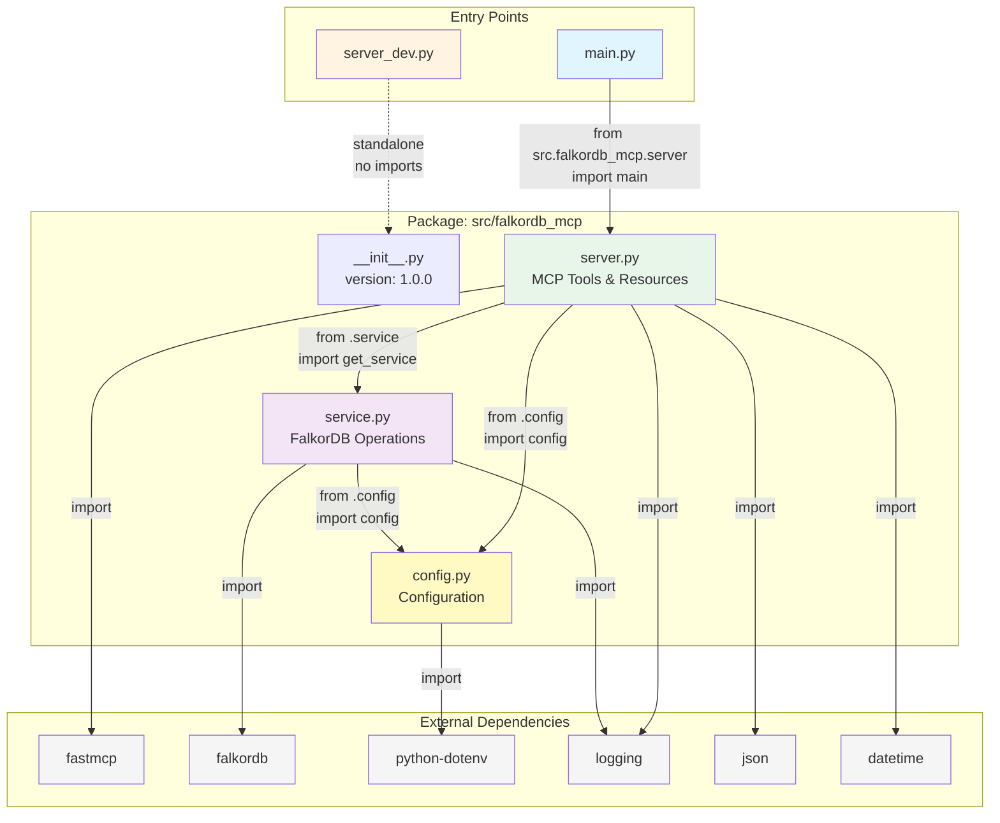

## Data Flow

This sequence diagram illustrates the complete flow of a typical MCP tool invocation, from the MCP client through the server layers to the FalkorDB database and back.

**Flow Description:**

1. **Client Request**: MCP client (e.g., Claude) calls an MCP tool
2. **Server Reception**: FastMCP framework routes to appropriate tool function
3. **Service Retrieval**: Tool function gets singleton service instance
4. **Database Operation**: Service executes query against FalkorDB
5. **Response Formatting**: Results wrapped in JSON response
6. **Client Response**: Formatted response returned to MCP client

**Example Flow**: `execute_query` tool invocation

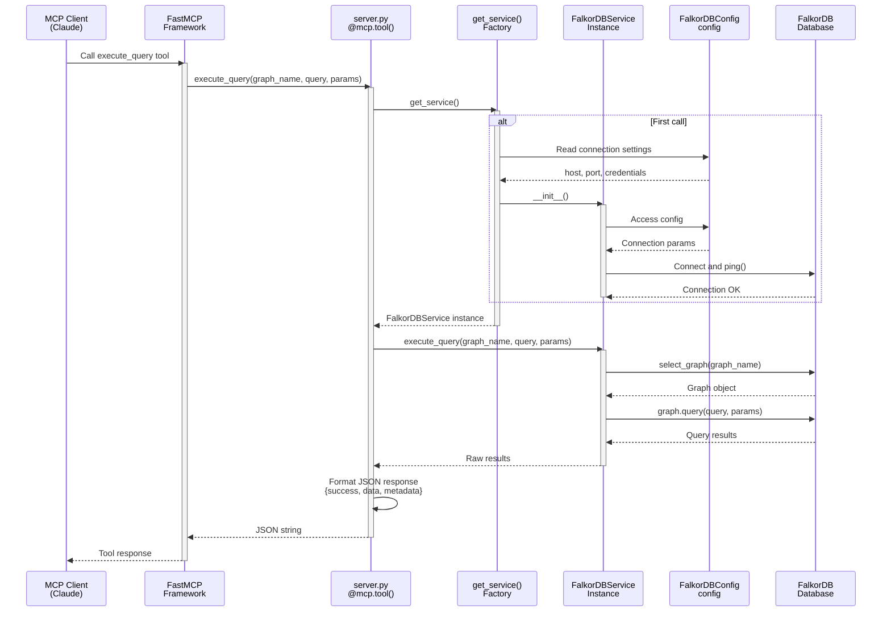

## Resource Access Flow

This diagram shows how MCP resources are accessed, which provide read-only information about the FalkorDB server state.

**Resource Types:**
- **falkordb://graphs**: List of all available graphs
- **falkordb://status**: Server connection status

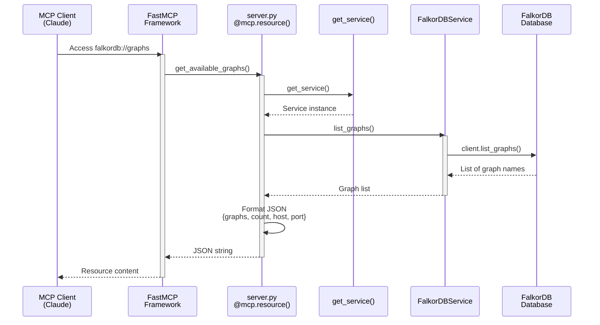

## Error Handling Flow

The system implements comprehensive error handling at each layer with proper logging and error propagation.

```mermaid
sequenceDiagram
    participant Client as MCP Client
    participant Server as server.py<br/>Tool Function
    participant Service as FalkorDBService
    participant DB as FalkorDB
    participant Logger as Logging System

    Client->>Server: execute_query(...)
    activate Server

    Server->>Service: execute_query(...)
    activate Service

    Service->>DB: graph.query(...)
    activate DB

    alt Query Error
        DB-->>Service: Exception
        deactivate DB
        Service->>Logger: Log error with graph name
        Service->>Service: Sanitize graph name
        Service-->>Server: Raise exception
        deactivate Service

        Server->>Server: Catch exception
        Server->>Server: Format error response<br/>{success: false, error, graphName}
        Server-->>Client: Error JSON
    else Query Success
        DB-->>Service: Results
        deactivate DB
        Service-->>Server: Results
        deactivate Service

        Server->>Server: Format success response<br/>{success: true, data, metadata}
        Server-->>Client: Success JSON
    end
    deactivate Server
```

## Initialization Sequence

This diagram shows the application startup sequence, including configuration loading, service initialization, and server registration.

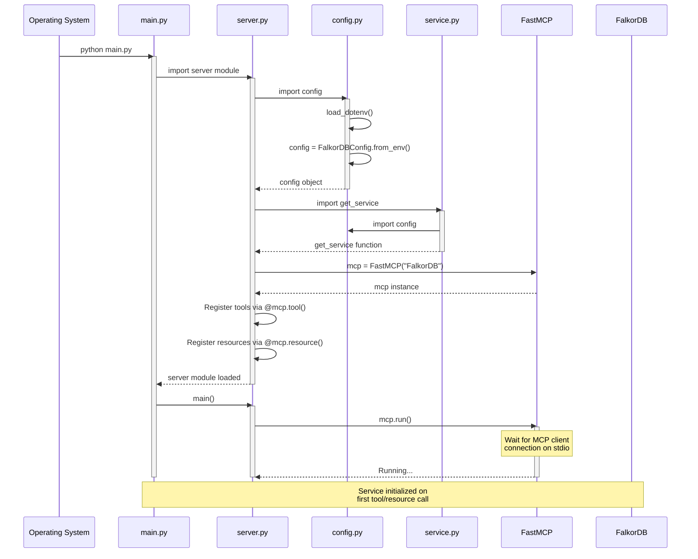

## Configuration Loading

This diagram details the environment-based configuration loading process.

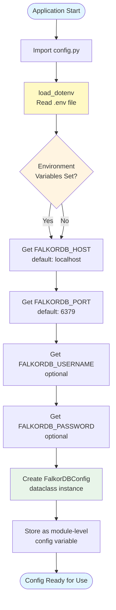

## Service Lifecycle

The FalkorDBService follows a singleton pattern with lazy initialization and connection pooling.

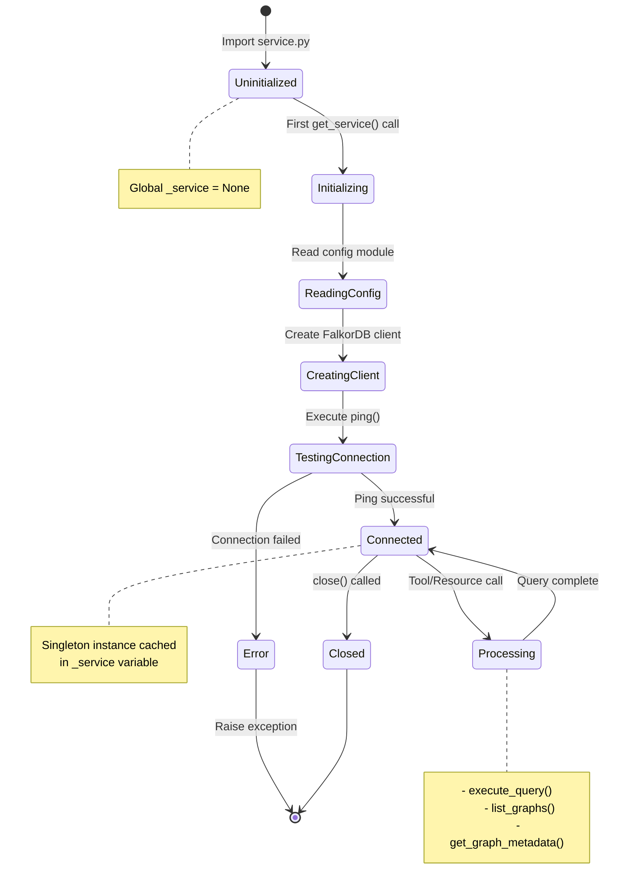

## Tool Registration Pattern

FastMCP uses Python decorators for tool and resource registration, providing a clean, declarative API.

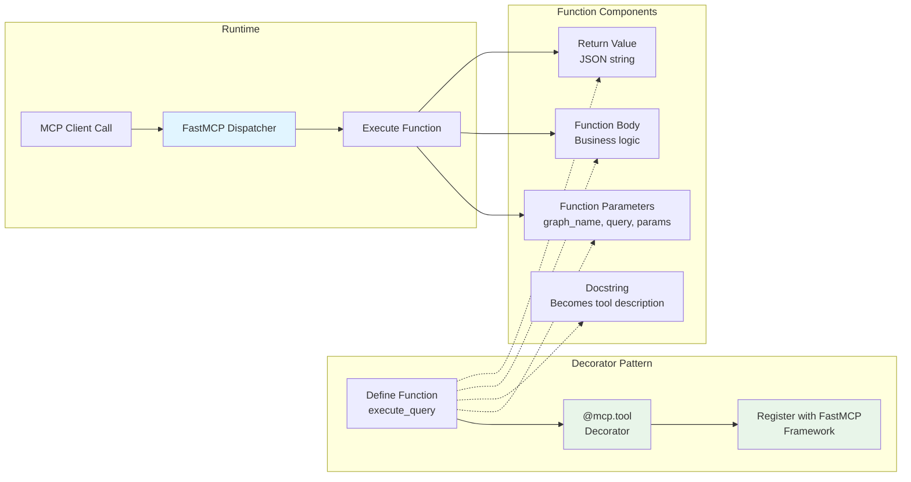

## Deployment Architecture

The system supports multiple deployment modes for different use cases.

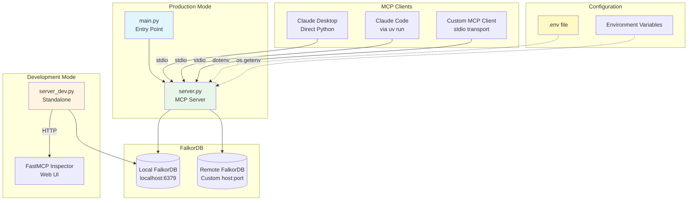

## Package Structure

Visual representation of the package organization and file relationships.

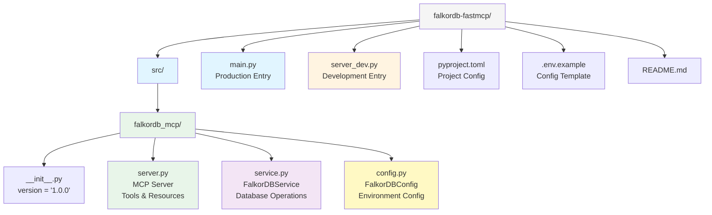
