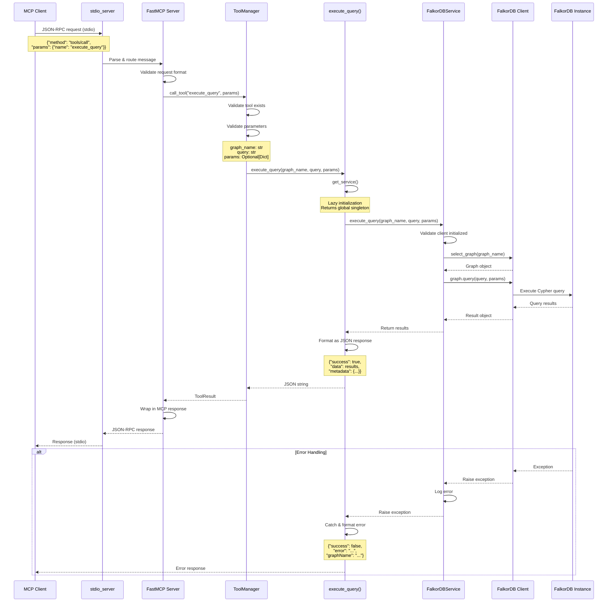
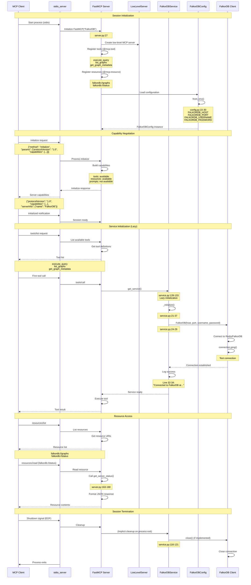
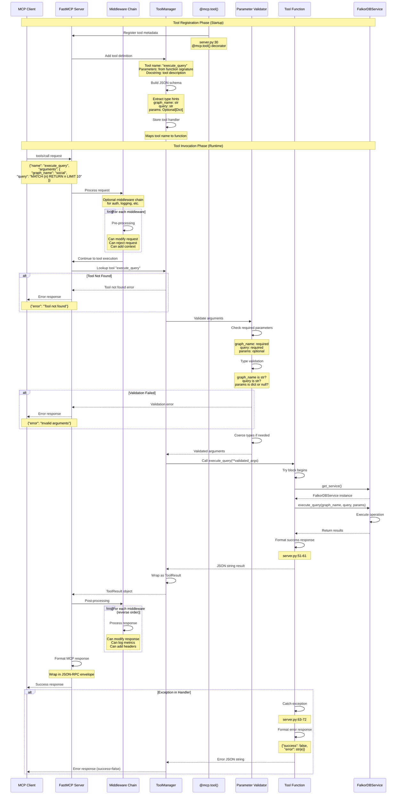
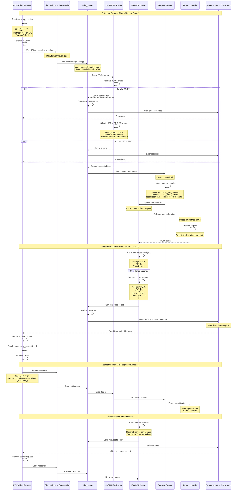

# Data Flow Analysis

## Overview

The FalkorDB FastMCP server implements a layered architecture for processing Model Context Protocol (MCP) requests. Data flows through several distinct layers:

1. **Transport Layer**: Handles stdio/HTTP/SSE communication with MCP clients
2. **Protocol Layer**: Processes JSON-RPC 2.0 messages according to MCP specification
3. **FastMCP Framework**: Routes requests to tools, resources, and prompts
4. **Service Layer**: Manages FalkorDB connections and operations
5. **Database Layer**: Executes Cypher queries against FalkorDB

The system uses a singleton service pattern for database connections and supports both synchronous tool execution and asynchronous MCP protocol handling. All data flows follow a request-response pattern with comprehensive error handling at each layer.

## 1. Simple Query Flow

The most common operation is executing a Cypher query against a FalkorDB graph. This flow demonstrates how a client request travels through all layers of the system.



### Detailed Execution Steps

**1. Client Request (Lines: client to stdio)**
- MCP client sends JSON-RPC 2.0 message via stdin
- Message format: `{"jsonrpc": "2.0", "method": "tools/call", "params": {"name": "execute_query", "arguments": {...}}}`
- stdio transport reads from stdin and deserializes JSON

**2. Protocol Processing (Lines: stdio to FastMCP)**
- `stdio_server` from mcp.server.stdio handles stdio transport (external library)
- Validates JSON-RPC 2.0 format
- Extracts method name and parameters
- Routes to FastMCP server instance (`server.py:27-28`)

**3. Tool Dispatch (Lines: FastMCP to ToolManager)**
- FastMCP server (`server.py`) receives tools/call request
- ToolManager validates tool name "execute_query" exists
- Type validation for parameters using function signature
- Parameters: `graph_name: str`, `query: str`, `params: Optional[Dict[str, Any]]`

**4. Tool Execution (Lines: Handler)**
- Decorated function `execute_query()` in `server.py:30-72`
- Calls `get_service()` from `service.py:128-133` to get singleton instance
- If service doesn't exist, creates new FalkorDBService instance

**5. Service Layer Processing (Lines: Service)**
- `FalkorDBService.execute_query()` in `service.py:46-72`
- Validates `_client` is not None (line 42-44)
- Calls `self.client.select_graph(graph_name)` (line 64)
- Returns Graph object from FalkorDB client library

**6. Database Execution (Lines: FalkorDB to DB)**
- FalkorDB Python client library (external: `falkordb` package)
- `graph.query(query, params or {})` executes Cypher query (line 65)
- Sends query to FalkorDB instance via Redis protocol
- Returns result set with nodes, relationships, and metadata

**7. Response Formatting (Lines: Handler to Client)**
- Handler catches result and formats as JSON (lines 51-61):
  - `success: True`
  - `data: result` (query results)
  - `metadata: {graphName, query, timestamp}`
- Returns JSON string to ToolManager
- FastMCP wraps in MCP response format
- stdio_server writes JSON-RPC response to stdout

**8. Error Handling Flow**
- Any exception in chain is caught by handler (lines 63-72)
- Formatted as error response: `{"success": false, "error": str(e), ...}`
- Logged at service layer (line 69-71)
- Sanitizes graph name to prevent log injection (line 68)

## 2. Interactive Client Session Flow

This flow shows how an MCP client establishes and maintains a session with the FastMCP server, including initialization, capability negotiation, and resource discovery.



### Detailed Session Lifecycle

**1. Process Startup (`main.py:1-7`)**
- Client spawns Python process: `python main.py`
- Entry point imports and calls `main()` from `server.py:183-189`
- Logging configured at module level (`server.py:19-24`)

**2. FastMCP Initialization (`server.py:27`)**
- Creates FastMCP instance with name "FalkorDB"
- Registers decorated tools (lines 30-137)
- Registers decorated resources (lines 140-180)
- Creates internal LowLevelServer for MCP protocol handling

**3. Configuration Loading (`config.py:1-34`)**
- `load_dotenv()` loads `.env` file (line 10)
- `FalkorDBConfig.from_env()` reads environment variables (lines 22-30)
- Global `config` instance created (line 34)
- Default values: localhost:6379, no auth

**4. MCP Protocol Initialization**
- Client sends `initialize` request with capabilities
- FastMCP responds with server capabilities and info
- Bidirectional capability negotiation establishes protocol version

**5. Tool Discovery**
- Client requests `tools/list`
- FastMCP introspects decorated `@mcp.tool()` functions
- Returns tool schemas with parameter types and descriptions

**6. Lazy Service Initialization (`service.py:128-133`)**
- Global `_service` variable initially None (line 125)
- First tool call triggers `get_service()`
- Creates singleton FalkorDBService instance
- `__init__` calls `_initialize()` (lines 16-19)

**7. Database Connection (`service.py:21-37`)**
- Creates FalkorDB client with config parameters
- Tests connection with `ping()` command
- Logs success or raises exception
- Connection persists for entire session

**8. Resource Access Pattern**
- Resources provide read-only data via URI scheme
- `falkordb://status` returns connection info (lines 163-180)
- `falkordb://graphs` returns graph list (lines 140-160)
- No parameters, pure functions

**9. Session Cleanup**
- Client closes stdin (EOF signal)
- stdio_server detects EOF and initiates shutdown
- Python process exits, closing all connections
- FalkorDB connection closed via destructor or explicit `close()`

## 3. Tool Permission Callback Flow

FastMCP uses decorators to register tools and handle authorization. This flow shows how tool permissions are validated and how callbacks are invoked.



### Detailed Permission and Callback Mechanics

**1. Tool Registration (`server.py:30-137`)**
- `@mcp.tool()` decorator registers function with FastMCP
- Decorator inspects function signature using `inspect` module
- Extracts parameter names, types, and defaults
- Parses docstring for tool description
- Stores mapping: tool_name -> handler_function

**2. Schema Generation**
- ToolManager builds JSON Schema from type hints
- `str` -> `{"type": "string"}`
- `Optional[Dict[str, Any]]` -> `{"type": "object", "nullable": true}`
- Required vs optional based on default values
- Schema sent to client in `tools/list` response

**3. Request Processing Entry**
- Client sends `tools/call` with tool name and arguments
- FastMCP receives via stdio_server (JSON-RPC)
- Creates MiddlewareContext with request details
- Enters middleware chain

**4. Middleware Chain Processing**
- Middleware can be added via FastMCP constructor
- Each middleware receives MiddlewareContext
- Can inspect/modify request before tool execution
- Can inspect/modify response after tool execution
- Used for: auth, logging, rate limiting, metrics
- Default: no middleware in this implementation

**5. Tool Lookup and Validation**
- ToolManager maintains dict of registered tools
- Lookup by name: O(1) operation
- Returns NotFoundError if tool doesn't exist
- Retrieves parameter schema for validation

**6. Parameter Validation**
- Validates each argument against schema
- Required parameters must be present
- Type checking using JSON Schema validation
- Coercion when possible (e.g., "123" -> 123 if number expected)
- Builds **kwargs dict for function call

**7. Handler Invocation**
- Calls actual function: `execute_query(**validated_args)`
- Function executes with validated inputs
- No additional permission checks in handler
- Assumes validation is sufficient authorization

**8. Service Layer Call (`service.py:46-72`)**
- Handler calls service method with same parameters
- Service layer doesn't validate permissions
- Focuses on database operations
- Raises exceptions for operational errors

**9. Response Formatting**
- Handler always returns JSON string
- Wraps results in standard envelope:
  - Success case: `{"success": true, "data": ..., "metadata": ...}`
  - Error case: `{"success": false, "error": ...}`
- ToolManager wraps in ToolResult object
- FastMCP wraps in JSON-RPC response

**10. Error Handling**
- Try/except in handler catches all exceptions (line 63)
- Logs error at service layer (line 69-71)
- Returns error response without exposing internals
- Client receives `success: false` but process continues

**11. No Explicit Permission System**
- This implementation has no granular permissions
- All tools available to all clients
- Authorization handled externally (e.g., MCP client config)
- Could add middleware for permission checks

## 4. MCP Server Communication Flow

This flow details how the MCP protocol messages are exchanged between client and server, including JSON-RPC formatting and the stdio transport mechanism.



### Detailed Protocol Mechanics

**1. stdio Transport Setup**
- MCP client spawns server process with stdio transport
- Three streams: stdin (client→server), stdout (server→client), stderr (logs)
- Line-delimited JSON: each message is one line
- Newline character (`\n`) separates messages

**2. JSON-RPC 2.0 Format**
- Request: `{"jsonrpc": "2.0", "id": number|string, "method": string, "params": object}`
- Response: `{"jsonrpc": "2.0", "id": number|string, "result": any}` OR `{"jsonrpc": "2.0", "id": number|string, "error": object}`
- Notification: `{"jsonrpc": "2.0", "method": string, "params": object}` (no id field)
- ID matches request to response in async scenarios

**3. stdio_server Implementation** (external library: `mcp.server.stdio`)
- Reads stdin in loop: `for line in sys.stdin`
- Non-blocking or blocking based on configuration
- Parses JSON for each line
- Validates JSON-RPC format
- Routes to appropriate handler

**4. Method Routing**
MCP specification defines standard methods:
- `initialize`: Capability negotiation
- `tools/list`: List available tools
- `tools/call`: Execute a tool
- `resources/list`: List available resources
- `resources/read`: Read a resource
- `prompts/list`: List available prompts
- `prompts/get`: Get a prompt

**5. Request Processing**
- Router extracts `method` and `params` from request
- Looks up handler in FastMCP server
- Handlers defined in FastMCP server class
- Parameters extracted and validated
- Handler executes business logic

**6. Response Construction**
- Handler returns result object
- FastMCP wraps in JSON-RPC response format
- Copies `id` from request to response
- Adds `result` or `error` field
- Never returns both result and error

**7. Error Handling**
JSON-RPC error codes:
- `-32700`: Parse error (invalid JSON)
- `-32600`: Invalid request (malformed JSON-RPC)
- `-32601`: Method not found
- `-32602`: Invalid params
- `-32603`: Internal error
- `-32000 to -32099`: Server-defined errors

**8. Output Serialization**
- Response object serialized to JSON
- Compact format (no pretty printing)
- Newline appended
- Written to stdout atomically
- Flushed immediately for real-time communication

**9. Concurrency Model**
- stdio transport is sequential (one request at a time)
- Server processes requests in order received
- No parallel execution in stdio mode
- HTTP/SSE transports support concurrency

**10. State Management**
- Server maintains session state between requests
- No cookies or tokens needed
- Process isolation provides security boundary
- Client can't access other client's sessions

**11. Logging and Debugging**
- stderr used for logging (doesn't interfere with stdio)
- Configured in `server.py:19-24`
- Logs include request/response details
- Helpful for debugging protocol issues

## 5. Message Parsing and Routing

This flow shows how incoming MCP messages are parsed, validated, and routed to the appropriate handlers within the FastMCP framework.

```mermaid
sequenceDiagram
    participant Stdio as stdio_server
    participant Parser as Message Parser
    participant Validator as Schema Validator
    participant Router as Method Router
    participant ToolRouter as Tool Router
    participant ResourceRouter as Resource Router
    participant ToolMgr as ToolManager
    participant ResourceMgr as ResourceManager
    participant Handler as Handler Function

    Note over Stdio,Handler: Message Reception and Initial Parsing

    Stdio->>Parser: Raw JSON string from stdin

    Parser->>Parser: json.loads(message)
    alt Invalid JSON
        Parser-->>Stdio: Return parse error
        Note over Parser,Stdio: Error code: -32700
    end

    Parser->>Parser: Extract message type
    Note over Parser: Has 'id'? → Request/Response<br/>No 'id'? → Notification<br/>Has 'result' or 'error'? → Response<br/>Has 'method'? → Request/Notification

    Parser->>Validator: Validate message structure

    Note over Stdio,Handler: Request Validation

    Validator->>Validator: Check JSON-RPC version
    Note over Validator: jsonrpc === "2.0"

    alt Invalid version
        Validator-->>Stdio: Invalid request error
        Note over Validator,Stdio: Error code: -32600
    end

    Validator->>Validator: Validate required fields
    Note over Validator: Request: id, method, params?<br/>Response: id, result OR error<br/>Notification: method, params?

    Validator->>Validator: Validate method format
    Note over Validator: method is string<br/>follows pattern: "namespace/action"

    alt Missing/invalid fields
        Validator-->>Stdio: Invalid request error
    end

    Validator-->>Parser: Message structure valid

    Parser->>Router: Route by method namespace
    Note over Parser,Router: Extract namespace from method<br/>"tools/call" → "tools"<br/>"resources/read" → "resources"

    Note over Stdio,Handler: Method Routing

    Router->>Router: Match method to handler category

    alt method.startsWith("tools/")
        Router->>ToolRouter: Route to tool handlers

        ToolRouter->>ToolRouter: Parse tool method
        Note over ToolRouter: "tools/list" → list<br/>"tools/call" → call

        alt tools/list
            ToolRouter->>ToolMgr: list_tools()
            ToolMgr->>ToolMgr: Get registered tools
            Note over ToolMgr: Iterate @mcp.tool() decorators
            ToolMgr->>ToolMgr: Build tool schemas
            ToolMgr-->>ToolRouter: List of tool definitions
            ToolRouter-->>Router: Tool list result
        end

        alt tools/call
            ToolRouter->>ToolRouter: Extract tool name
            Note over ToolRouter: params.name

            ToolRouter->>ToolMgr: get_tool(name)

            alt Tool not found
                ToolMgr-->>Router: Method not found error
                Note over ToolMgr,Router: Error code: -32601
            end

            ToolMgr->>ToolMgr: Validate tool arguments
            Note over ToolMgr: params.arguments vs tool schema

            alt Invalid arguments
                ToolMgr-->>Router: Invalid params error
                Note over ToolMgr,Router: Error code: -32602
            end

            ToolMgr->>Handler: Call tool function
            Handler->>Handler: Execute tool logic
            Handler-->>ToolMgr: Tool result
            ToolMgr-->>ToolRouter: Wrapped result
            ToolRouter-->>Router: Response
        end
    end

    alt method.startsWith("resources/")
        Router->>ResourceRouter: Route to resource handlers

        ResourceRouter->>ResourceRouter: Parse resource method
        Note over ResourceRouter: "resources/list" → list<br/>"resources/read" → read

        alt resources/list
            ResourceRouter->>ResourceMgr: list_resources()
            ResourceMgr->>ResourceMgr: Get registered resources
            Note over ResourceMgr: Iterate @mcp.resource() decorators
            ResourceMgr-->>ResourceRouter: Resource list
            ResourceRouter-->>Router: Result
        end

        alt resources/read
            ResourceRouter->>ResourceRouter: Extract resource URI
            Note over ResourceRouter: params.uri

            ResourceRouter->>ResourceMgr: get_resource(uri)

            alt Resource not found
                ResourceMgr-->>Router: Not found error
            end

            ResourceMgr->>Handler: Call resource function
            Handler->>Handler: Generate resource content
            Handler-->>ResourceMgr: Resource content
            ResourceMgr-->>ResourceRouter: Wrapped content
            ResourceRouter-->>Router: Response
        end
    end

    alt method === "initialize"
        Router->>Router: Handle initialization
        Note over Router: Build server capabilities<br/>Return server info
        Router-->>Stdio: Initialize response
    end

    alt method === "ping"
        Router->>Router: Handle ping
        Router-->>Stdio: Pong response
    end

    alt Unknown method
        Router-->>Stdio: Method not found error
        Note over Router,Stdio: Error code: -32601
    end

    Note over Stdio,Handler: Response Construction

    Router->>Router: Build response object
    Note over Router: {"jsonrpc": "2.0",<br/>"id": request.id,<br/>"result": ...}

    Router-->>Stdio: Return response
    Stdio->>Stdio: Serialize and send
```



### Detailed Routing Mechanics

**1. Initial Message Reception**
- stdio_server reads line from stdin
- Blocking read: waits for newline
- Message stored as string in memory

**2. JSON Parsing**
- `json.loads(message_str)` parses to dict
- Python dict represents JSON object
- Throws JSONDecodeError for invalid JSON
- Error caught and converted to JSON-RPC error -32700

**3. Message Type Detection**
```python
if "method" in msg and "id" in msg:
    # Request (expects response)
elif "method" in msg:
    # Notification (no response)
elif "result" in msg or "error" in msg:
    # Response to previous request
```

**4. Schema Validation**
- Validates required fields based on message type
- Checks data types: `id` must be number/string, `method` must be string
- Validates `params` is object if present
- No external schema validation library needed (simple checks)

**5. Method Namespace Extraction**
```python
method = msg["method"]  # e.g., "tools/call"
namespace, action = method.split("/", 1)  # "tools", "call"
```

**6. Tool Routing Logic** (`server.py:30-137`)
- `tools/list`: Handled by FastMCP's internal list_tools handler
  - Calls ToolManager to get all registered tools
  - Filters by tags if configured
  - Returns tool schemas with parameter definitions

- `tools/call`: Handled by call_tool handler
  - Extracts tool name from `params.name`
  - Looks up tool in ToolManager's registry
  - Validates arguments against tool's schema
  - Invokes handler function
  - Returns result or error

**7. Resource Routing Logic** (`server.py:140-180`)
- `resources/list`: Returns all registered resource URIs
  - Calls ResourceManager
  - Returns list of `{"uri": "...", "name": "...", "description": "..."}`

- `resources/read`: Reads specific resource
  - Extracts URI from `params.uri`
  - Matches URI to registered resource
  - Calls resource handler function
  - Returns content (usually JSON string)

**8. Tool Registration and Storage**
- `@mcp.tool()` decorator called at import time
- Decorator adds function to ToolManager's internal dict
- Key: function name (or explicit name from decorator)
- Value: ToolDefinition object with function, schema, metadata

**9. Parameter Validation Flow**
```python
# In ToolManager
def call_tool(name: str, arguments: dict):
    tool_def = self.tools[name]  # Lookup
    schema = tool_def.schema
    # Validate arguments against schema
    for param_name, param_schema in schema.items():
        if param_schema.required and param_name not in arguments:
            raise InvalidParams(f"Missing required parameter: {param_name}")
        # Type validation
        if param_name in arguments:
            validate_type(arguments[param_name], param_schema.type)
    # Call handler
    return tool_def.handler(**arguments)
```

**10. Error Response Generation**
- All errors converted to JSON-RPC error format
- Error object includes: `code`, `message`, optional `data`
- Error codes standardized across implementations
- Stack traces included in `data` for debugging (if enabled)

**11. Response Mapping**
- Request ID tracked throughout processing
- Response includes same ID for correlation
- Client matches response to pending request
- Timeout mechanisms in client code (not server responsibility)

**12. Notification Handling**
- No response sent for notifications
- Used for one-way messages (e.g., "initialized")
- Server can ignore or process silently
- Errors in notification handling logged but not returned

## 6. Error Handling Flow

This flow demonstrates how errors are detected, propagated, and handled across all layers of the system, ensuring graceful degradation and informative error messages.

```mermaid
sequenceDiagram
    participant Client as MCP Client
    participant Stdio as stdio_server
    participant FastMCP as FastMCP Server
    participant ToolMgr as ToolManager
    participant Handler as execute_query()
    participant Service as FalkorDBService
    participant FalkorDB as FalkorDB Client
    participant Logger as Logger

    Note over Client,Logger: Scenario 1: Invalid JSON from Client

    Client->>Stdio: Malformed JSON
    Note over Client,Stdio: "{invalid json"

    Stdio->>Stdio: json.loads() throws
    Note over Stdio: JSONDecodeError

    Stdio->>Logger: Log parse error
    Stdio->>Stdio: Create error response
    Note over Stdio: {"jsonrpc": "2.0",<br/>"id": null,<br/>"error": {<br/>  "code": -32700,<br/>  "message": "Parse error"<br/>}}

    Stdio-->>Client: Parse error response
    Client->>Client: Handle protocol error

    Note over Client,Logger: Scenario 2: Tool Not Found

    Client->>Stdio: tools/call request
    Note over Client,Stdio: {"name": "nonexistent_tool"}

    Stdio->>FastMCP: Route request
    FastMCP->>ToolMgr: get_tool("nonexistent_tool")

    ToolMgr->>ToolMgr: Lookup in registry
    ToolMgr->>ToolMgr: Tool not found

    ToolMgr->>Logger: Log tool not found
    Note over Logger: WARNING level

    ToolMgr-->>FastMCP: Raise NotFoundError
    FastMCP->>FastMCP: Catch NotFoundError
    FastMCP->>FastMCP: Build error response
    Note over FastMCP: {"error": {<br/>  "code": -32601,<br/>  "message": "Method not found"<br/>}}

    FastMCP-->>Client: Error response
    Client->>Client: Display error to user

    Note over Client,Logger: Scenario 3: Invalid Parameters

    Client->>Stdio: tools/call request
    Note over Client,Stdio: {"name": "execute_query",<br/>"arguments": {<br/>  "graph_name": 123,<br/>  "query": ["invalid"]<br/>}}

    Stdio->>FastMCP: Route request
    FastMCP->>ToolMgr: call_tool with arguments

    ToolMgr->>ToolMgr: Validate parameters
    Note over ToolMgr: graph_name should be str,<br/>got int

    ToolMgr->>Logger: Log validation error
    ToolMgr-->>FastMCP: Raise ValidationError

    FastMCP->>FastMCP: Catch ValidationError
    FastMCP->>FastMCP: Build error response
    Note over FastMCP: {"error": {<br/>  "code": -32602,<br/>  "message": "Invalid params",<br/>  "data": {"details": "..."}}<br/>}

    FastMCP-->>Client: Validation error response

    Note over Client,Logger: Scenario 4: Service Initialization Failure

    Client->>Stdio: First tool call
    Stdio->>FastMCP: tools/call
    FastMCP->>Handler: execute_query()

    Handler->>Service: get_service()
    Service->>Service: _initialize()
    Service->>FalkorDB: FalkorDB(host, port, ...)

    FalkorDB->>FalkorDB: Attempt connection
    FalkorDB-->>Service: ConnectionError
    Note over FalkorDB: Cannot connect to<br/>localhost:6379

    Service->>Logger: Log connection error
    Note over Logger: ERROR level<br/>"Failed to connect to FalkorDB"<br/>service.py:36

    Service-->>Handler: Raise ConnectionError

    Handler->>Handler: Catch exception
    Note over Handler: except Exception as e:<br/>server.py:63

    Handler->>Handler: Format error response
    Note over Handler: {"success": false,<br/>"error": str(e),<br/>"graphName": graph_name,<br/>"query": query}

    Handler-->>ToolMgr: Return error JSON
    ToolMgr-->>FastMCP: ToolResult (error)
    FastMCP-->>Client: Response with success=false

    Client->>Client: Check success field
    Client->>Client: Display error message

    Note over Client,Logger: Scenario 5: Query Execution Error

    Client->>Stdio: execute_query request
    Stdio->>FastMCP: Process request
    FastMCP->>Handler: execute_query("graph1", "INVALID CYPHER")

    Handler->>Service: execute_query(...)
    Service->>FalkorDB: select_graph("graph1")
    FalkorDB-->>Service: Graph object

    Service->>FalkorDB: graph.query("INVALID CYPHER")
    FalkorDB->>FalkorDB: Parse Cypher query
    FalkorDB-->>Service: SyntaxError
    Note over FalkorDB: Invalid Cypher syntax

    Service->>Service: Sanitize graph name
    Note over Service: service.py:68<br/>Replace newlines

    Service->>Logger: Log query error
    Note over Logger: ERROR level<br/>"Error executing query on graph 'graph1'"<br/>service.py:69-71

    Service-->>Handler: Raise exception

    Handler->>Handler: Catch exception
    Handler->>Handler: Format error response
    Note over Handler: server.py:64-72<br/>Includes: success=false,<br/>error message,<br/>graph name, query

    Handler-->>Client: Error response
    Client->>Client: Parse error details
    Client->>Client: Display to user

    Note over Client,Logger: Scenario 6: Resource Not Found

    Client->>Stdio: resources/read
    Note over Client,Stdio: {"uri": "falkordb://invalid"}

    Stdio->>FastMCP: Route request
    FastMCP->>FastMCP: Lookup resource by URI

    FastMCP->>FastMCP: URI not in registry
    FastMCP->>Logger: Log resource not found

    FastMCP->>FastMCP: Build error response
    Note over FastMCP: Custom error or<br/>generic not found

    FastMCP-->>Client: Error response

    Note over Client,Logger: Scenario 7: Unexpected Runtime Error

    Client->>Stdio: tools/call
    Stdio->>FastMCP: Route request
    FastMCP->>Handler: execute_query()

    Handler->>Handler: Unexpected error occurs
    Note over Handler: e.g., Memory error,<br/>Disk full, etc.

    Handler->>Handler: Catch Exception
    Note over Handler: Broad except clause<br/>catches all errors<br/>server.py:63

    Handler->>Logger: Error logged by service layer
    Note over Logger: If error occurs in service

    Handler->>Handler: Format generic error
    Note over Handler: {"success": false,<br/>"error": "Unexpected error",<br/>...}

    Handler-->>Client: Error response
    Client->>Client: Handle gracefully

    Note over Client,Logger: Error Recovery and Retry

    Client->>Client: Detect retryable error
    Note over Client: Connection errors,<br/>timeouts, etc.

    Client->>Client: Wait with backoff
    Client->>Stdio: Retry request
    Note over Client: Same request, new ID

    Stdio->>FastMCP: Process retry
    FastMCP->>Handler: execute_query()
    Handler->>Service: Try again

    alt Connection restored
        Service->>FalkorDB: Query executes
        FalkorDB-->>Service: Results
        Service-->>Handler: Success
        Handler-->>Client: Success response
    else Still failing
        Service-->>Handler: Error
        Handler-->>Client: Error response
        Client->>Client: Give up after N retries
    end
```



### Detailed Error Handling Strategies

**1. Layered Error Handling**
Each layer has specific error handling responsibility:
- **Transport Layer**: Malformed JSON, protocol errors
- **FastMCP Layer**: Method routing, tool/resource lookup
- **Validation Layer**: Parameter type/schema validation
- **Handler Layer**: Business logic errors, formatting
- **Service Layer**: Database operations, connection issues
- **Database Layer**: Query syntax, execution errors

**2. Error at Transport Layer**
- stdio_server catches JSON parse errors
- Returns JSON-RPC error -32700 (Parse error)
- Response sent even if request ID unknown (id = null)
- Logged to stderr for debugging

**3. Error at Protocol Layer**
- Invalid JSON-RPC format: missing required fields
- Wrong version: not "2.0"
- Returns error -32600 (Invalid Request)
- Server continues processing subsequent messages

**4. Tool/Resource Not Found**
- Looked up in ToolManager/ResourceManager registry
- Returns error -32601 (Method not found)
- FastMCP exception: `NotFoundError` (`exceptions.py`)
- Logged at WARNING level (not ERROR - expected scenario)

**5. Parameter Validation Errors**
```python
# In ToolManager
def validate_parameters(schema: dict, arguments: dict):
    for param_name, param_def in schema.items():
        if param_def.required and param_name not in arguments:
            raise ValidationError(f"Missing parameter: {param_name}")
        if param_name in arguments:
            expected_type = param_def.type
            actual_value = arguments[param_name]
            if not isinstance(actual_value, expected_type):
                raise ValidationError(
                    f"Parameter {param_name}: expected {expected_type}, "
                    f"got {type(actual_value)}"
                )
```
- Returns error -32602 (Invalid params)
- Includes detailed error message in `data` field
- Client can display specific validation failure

**6. Service Initialization Errors** (`service.py:21-37`)
```python
def _initialize(self) -> None:
    try:
        self._client = FalkorDB(...)
        self._client.connection.ping()
        logger.info(f"✓ Connected to FalkorDB at {config.host}:{config.port}")
    except Exception as e:
        logger.error(f"Failed to connect to FalkorDB: {e}")
        raise  # Re-raise to propagate to handler
```
- Logs error at ERROR level
- Re-raises exception to handler
- Handler catches and formats as JSON error response
- Service remains uninitialized (retry might succeed)

**7. Query Execution Errors** (`service.py:46-72`)
```python
def execute_query(self, graph_name: str, query: str, ...):
    try:
        graph = self.client.select_graph(graph_name)
        result = graph.query(query, params or {})
        return result
    except Exception as e:
        sanitized_graph = graph_name.replace("\n", "").replace("\r", "")
        logger.error(f"Error executing query on graph '{sanitized_graph}': {e}")
        raise  # Propagate to handler
```
- Sanitizes graph name before logging (security)
- Prevents log injection attacks
- Logs full error with context
- Re-raises for handler to format

**8. Handler Error Formatting** (`server.py:63-72`)
```python
except Exception as e:
    return json.dumps(
        {
            "success": False,
            "error": str(e),
            "graphName": graph_name,
            "query": query,
        },
        indent=2,
    )
```
- Catches all exceptions (broad except)
- Returns JSON with `success: false` flag
- Includes context: graph name, query
- Does NOT raise - always returns string

**9. Error Response Format**
Two formats coexist:
1. **JSON-RPC Error**: `{"jsonrpc": "2.0", "id": 1, "error": {...}}`
   - Used for protocol-level errors
   - Standard error codes
2. **Application Error**: `{"success": false, "error": "...", ...}`
   - Used for business logic errors
   - Returned as successful JSON-RPC response
   - Client must check `success` field

**10. Logging Strategy**
```python
# Configure logging (server.py:19-24)
logging.basicConfig(
    level=logging.INFO,
    format="%(asctime)s - %(name)s - %(levelname)s - %(message)s",
)
logger = logging.getLogger(__name__)
```
- Logs written to stderr (doesn't interfere with stdio)
- INFO: Normal operations, connections established
- WARNING: Expected errors, tool not found
- ERROR: Unexpected errors, connection failures
- Includes timestamp, logger name, level, message

**11. Security Considerations**
- Log sanitization prevents injection (`service.py:68`)
- Error messages don't expose internal paths
- Stack traces only in debug mode
- Connection credentials never logged

**12. Client-Side Error Handling**
Client should:
1. Parse JSON-RPC error field
2. Check application-level `success` field
3. Display user-friendly error messages
4. Implement retry logic for transient errors
5. Log errors for debugging
6. Handle connection loss gracefully

**13. Retry Strategy**
Retryable errors:
- Connection refused (database down)
- Timeout errors
- Transient network issues

Non-retryable errors:
- Invalid parameters
- Tool not found
- Syntax errors in queries
- Permission denied

**14. Graceful Degradation**
- Server continues after errors (doesn't crash)
- Service can be reinitialized on retry
- Session state preserved across errors
- Client can recover without reconnecting

## 7. Resource Access Flow

Resources provide read-only access to server data via URI schemes. This flow shows how MCP resources are registered, discovered, and accessed.

```mermaid
sequenceDiagram
    participant Client as MCP Client
    participant Stdio as stdio_server
    participant FastMCP as FastMCP Server
    participant ResourceMgr as ResourceManager
    participant Decorator as @mcp.resource()
    participant Handler as Resource Function
    participant Service as FalkorDBService
    participant Config as FalkorDBConfig

    Note over Client,Config: Resource Registration Phase (Startup)

    Decorator->>FastMCP: Register resource
    Note over Decorator: server.py:140<br/>@mcp.resource("falkordb://graphs")

    FastMCP->>ResourceMgr: Add resource definition
    Note over ResourceMgr: URI: "falkordb://graphs"<br/>Handler: get_available_graphs()<br/>Name: from docstring<br/>Description: from docstring

    Decorator->>FastMCP: Register second resource
    Note over Decorator: server.py:163<br/>@mcp.resource("falkordb://status")

    FastMCP->>ResourceMgr: Add resource definition
    Note over ResourceMgr: URI: "falkordb://status"<br/>Handler: get_server_status()

    ResourceMgr->>ResourceMgr: Build resource registry
    Note over ResourceMgr: Map URI -> Handler function

    Note over Client,Config: Resource Discovery

    Client->>Stdio: resources/list request
    Note over Client,Stdio: {"jsonrpc": "2.0",<br/>"method": "resources/list"}

    Stdio->>FastMCP: Route request
    FastMCP->>ResourceMgr: list_resources()

    ResourceMgr->>ResourceMgr: Iterate registered resources
    Note over ResourceMgr: For each @mcp.resource()

    ResourceMgr->>ResourceMgr: Build resource metadata
    Note over ResourceMgr: [{<br/>  "uri": "falkordb://graphs",<br/>  "name": "Available Graphs",<br/>  "description": "...",<br/>  "mimeType": "application/json"<br/>}, ...]

    ResourceMgr-->>FastMCP: List of resources
    FastMCP-->>Stdio: Resources list response
    Stdio-->>Client: JSON-RPC response

    Client->>Client: Display resources to user
    Note over Client: Show available resources<br/>in UI or cache for later

    Note over Client,Config: Resource Access: falkordb://status

    Client->>Stdio: resources/read request
    Note over Client,Stdio: {"method": "resources/read",<br/>"params": {<br/>  "uri": "falkordb://status"<br/>}}

    Stdio->>FastMCP: Route request
    FastMCP->>FastMCP: Extract URI from params
    Note over FastMCP: params.uri = "falkordb://status"

    FastMCP->>ResourceMgr: get_resource("falkordb://status")

    ResourceMgr->>ResourceMgr: Lookup URI in registry
    Note over ResourceMgr: O(1) dict lookup

    alt Resource not found
        ResourceMgr-->>FastMCP: Raise NotFoundError
        FastMCP-->>Client: Error response
        Note over FastMCP,Client: Resource does not exist
    end

    ResourceMgr->>Handler: Call get_server_status()
    Note over Handler: server.py:163-180<br/>No parameters

    Handler->>Handler: Build status object
    Note over Handler: {<br/>  "status": "connected",<br/>  "host": config.host,<br/>  "port": config.port,<br/>  "version": "1.0.0",<br/>  "timestamp": utcnow()<br/>}

    Handler->>Config: Access config.host, config.port
    Config-->>Handler: Configuration values
    Note over Config: From environment variables<br/>config.py:34

    Handler->>Handler: json.dumps() with indent
    Note over Handler: Pretty-print JSON<br/>indent=2

    Handler-->>ResourceMgr: JSON string
    ResourceMgr->>ResourceMgr: Wrap in resource response
    Note over ResourceMgr: Add metadata:<br/>URI, MIME type

    ResourceMgr-->>FastMCP: Resource content
    FastMCP-->>Stdio: Read response
    Note over FastMCP,Stdio: {"contents": [{<br/>  "uri": "falkordb://status",<br/>  "mimeType": "application/json",<br/>  "text": "..."<br/>}]}

    Stdio-->>Client: JSON-RPC response
    Client->>Client: Parse resource content
    Client->>Client: Display or process data

    Note over Client,Config: Resource Access: falkordb://graphs

    Client->>Stdio: resources/read request
    Note over Client,Stdio: {"uri": "falkordb://graphs"}

    Stdio->>FastMCP: Route request
    FastMCP->>ResourceMgr: get_resource("falkordb://graphs")

    ResourceMgr->>Handler: Call get_available_graphs()
    Note over Handler: server.py:140-160

    Handler->>Service: get_service()
    Note over Handler: Lazy service initialization<br/>service.py:128-133

    Service-->>Handler: FalkorDBService instance

    Handler->>Service: list_graphs()
    Note over Handler: service.py:74-88

    Service->>Service: Validate client initialized
    Service->>Service: self.client.list_graphs()
    Note over Service: FalkorDB client method<br/>Returns list of graph names

    Service-->>Handler: List of graph names
    Note over Service: ["social", "knowledge", "products"]

    Handler->>Handler: Build response object
    Note over Handler: {<br/>  "graphs": ["social", ...],<br/>  "count": 3,<br/>  "host": config.host,<br/>  "port": config.port,<br/>  "timestamp": utcnow()<br/>}

    Handler->>Config: Access config values
    Config-->>Handler: host, port

    Handler->>Handler: json.dumps() with indent
    Handler-->>ResourceMgr: JSON string

    ResourceMgr->>ResourceMgr: Wrap in resource response
    ResourceMgr-->>FastMCP: Resource content
    FastMCP-->>Client: Response

    Client->>Client: Parse graph list
    Client->>Client: Cache for future queries
    Note over Client: Now knows available graphs<br/>Can use in tool calls

    Note over Client,Config: Error Scenarios

    Client->>Stdio: resources/read
    Note over Client,Stdio: {"uri": "falkordb://unknown"}

    Stdio->>FastMCP: Route request
    FastMCP->>ResourceMgr: get_resource("falkordb://unknown")

    ResourceMgr->>ResourceMgr: URI not in registry
    ResourceMgr-->>FastMCP: NotFoundError

    FastMCP->>FastMCP: Format error response
    FastMCP-->>Client: Error response
    Note over FastMCP,Client: Resource not found

    alt Service unavailable during resource read
        Handler->>Service: list_graphs()
        Service->>Service: Attempt operation
        Service-->>Handler: Raise exception
        Note over Service: Database connection lost

        Handler->>Handler: Catch exception
        Note over Handler: Resources may or may not<br/>have error handling

        alt Resource has error handling
            Handler->>Handler: Return error JSON
            Handler-->>Client: Success with error data
            Note over Handler: {"error": "Service unavailable"}
        else Resource propagates error
            Handler-->>FastMCP: Raise exception
            FastMCP-->>Client: Error response
        end
    end
```



### Detailed Resource Access Mechanics

**1. Resource Registration** (`server.py:140-180`)
```python
@mcp.resource("falkordb://graphs")
def get_available_graphs() -> str:
    """
    Resource providing list of all available graphs in FalkorDB.

    Returns:
        JSON string with graphs, count, and server information
    """
    ...
```
- Decorator `@mcp.resource(uri)` registers function
- URI follows custom scheme: `protocol://path`
- Function must return string (usually JSON)
- Docstring becomes resource description
- Registered at import time (module load)

**2. Resource URI Schemes**
This implementation uses:
- `falkordb://graphs` - Dynamic list of available graphs
- `falkordb://status` - Server connection status

Could be extended with:
- `falkordb://graphs/{name}` - Specific graph info
- `falkordb://graphs/{name}/schema` - Graph schema
- `falkordb://config` - Server configuration

**3. Resource Discovery Flow**
Client workflow:
1. Connect to server
2. Send `resources/list` request
3. Receive list of available resource URIs
4. Display to user or cache for later
5. Access specific resources as needed

**4. ResourceManager Implementation**
```python
class ResourceManager:
    def __init__(self):
        self._resources: Dict[str, ResourceDefinition] = {}

    def register(self, uri: str, handler: Callable, ...):
        self._resources[uri] = ResourceDefinition(
            uri=uri,
            handler=handler,
            name=name,
            description=description,
        )

    def get_resource(self, uri: str) -> ResourceDefinition:
        if uri not in self._resources:
            raise NotFoundError(f"Resource not found: {uri}")
        return self._resources[uri]

    def list_resources(self) -> List[ResourceDefinition]:
        return list(self._resources.values())
```

**5. Resource Handler Execution**
- No parameters passed to resource handlers
- Resources are parameterless by design in this implementation
- URI templates could allow parameters (e.g., `/graphs/{name}`)
- Handler returns string (JSON)
- No schema validation on output

**6. Static vs Dynamic Resources**
- `falkordb://status`: Static resource (configuration data)
  - Returns same data structure each time
  - Values may change but structure is constant

- `falkordb://graphs`: Dynamic resource (query results)
  - Calls database to get current list
  - List changes as graphs are added/removed
  - May fail if database unavailable

**7. Resource Caching Considerations**
Client-side caching strategies:
- `falkordb://status`: Cache for session duration
- `falkordb://graphs`: Cache with TTL or invalidate on changes
- No server-side caching implemented
- Each read executes handler function

**8. Resource vs Tool**
When to use resource vs tool:
- **Resource**: Read-only, no side effects, URI-addressable
  - Examples: status, configuration, lists
- **Tool**: Actions, mutations, parameters required
  - Examples: execute query, create graph, delete data

**9. Resource Content Types**
```python
# In resource response
{
    "contents": [{
        "uri": "falkordb://status",
        "mimeType": "application/json",  # JSON data
        "text": "{...}"
    }]
}
```
- This implementation only uses `application/json`
- Could support other types: `text/plain`, `text/html`
- Binary data would use `blob` instead of `text` field

**10. Error Handling in Resources**
Resources have two error handling options:

Option 1: Return error in data
```python
@mcp.resource("falkordb://graphs")
def get_available_graphs() -> str:
    try:
        service = get_service()
        graphs = service.list_graphs()
        return json.dumps({"success": True, "graphs": graphs})
    except Exception as e:
        return json.dumps({"success": False, "error": str(e)})
```

Option 2: Propagate exception
```python
@mcp.resource("falkordb://status")
def get_server_status() -> str:
    # Let exceptions propagate
    # FastMCP will convert to error response
    return json.dumps({"status": "connected", ...})
```

**11. Resource Metadata**
ResourceDefinition includes:
- `uri`: Unique identifier
- `name`: Human-readable name
- `description`: Detailed description
- `mimeType`: Content type
- Additional metadata: tags, annotations

**12. URI Pattern Matching**
Current implementation: exact match only
```python
if uri == "falkordb://graphs":
    return handler()
```

Could be extended with pattern matching:
```python
if uri.startswith("falkordb://graphs/"):
    graph_name = uri.split("/")[-1]
    return handler(graph_name)
```

**13. Resource Composition**
Resources can call other resources:
```python
@mcp.resource("falkordb://summary")
def get_summary() -> str:
    status = get_server_status()  # Call another resource
    graphs = get_available_graphs()
    return json.dumps({
        "status": json.loads(status),
        "graphs": json.loads(graphs),
    })
```

**14. Security Considerations**
- Resources should not expose sensitive data
- No authentication/authorization in current implementation
- Could add middleware for access control
- URIs should not contain user input (injection risk)

## Summary

### Key Data Flow Patterns

**1. Layered Architecture**
The system employs strict separation of concerns:
- **Transport**: stdio/HTTP/SSE communication (mcp.server.stdio)
- **Protocol**: JSON-RPC 2.0 message handling (FastMCP framework)
- **Routing**: Method dispatch to tools/resources (FastMCP routing)
- **Validation**: Parameter schema validation (ToolManager)
- **Business Logic**: Tool/resource handlers (server.py)
- **Service**: Database operations (service.py)
- **Database**: FalkorDB client library (falkordb package)

**2. Singleton Service Pattern**
- Single global `FalkorDBService` instance (`service.py:125-133`)
- Lazy initialization on first tool call
- Persistent database connection across requests
- Reduces overhead of repeated connections
- Trade-off: shared state in multi-threaded scenarios (not applicable for stdio)

**3. Decorator-Based Registration**
- `@mcp.tool()` registers functions as MCP tools
- `@mcp.resource()` registers functions as MCP resources
- Metadata extracted from function signature and docstring
- Registration happens at module import time
- Zero boilerplate for developers

**4. Request-Response Cycle**
Standard flow for all operations:
1. Client sends JSON-RPC request via stdin
2. stdio_server parses and validates JSON
3. FastMCP routes to appropriate handler
4. Handler executes business logic
5. Result formatted as JSON
6. Response wrapped in JSON-RPC envelope
7. Written to stdout for client consumption

**5. Error Propagation Strategy**
Errors bubble up through layers:
- Database errors → Service layer (logged, re-raised)
- Service errors → Handler (caught, formatted as JSON)
- Handler returns error JSON (not exception)
- Client receives `success: false` in data
- Protocol errors return JSON-RPC error responses

**6. Dual Error Formats**
Two error representations coexist:
- **JSON-RPC errors**: Protocol-level issues (parse error, method not found)
- **Application errors**: Business logic failures (query syntax error, connection failure)
- Client must handle both formats

**7. Synchronous Execution Model**
- stdio transport processes one request at a time
- No parallel tool execution in stdio mode
- Simpler error handling and state management
- HTTP/SSE transports support concurrency

**8. Type Safety**
- Python type hints throughout codebase
- Parameter validation using JSON Schema
- Type coercion when possible
- Runtime type checking in ToolManager

**9. Resource as Read-Only Views**
- Resources provide data snapshots
- No side effects or mutations
- URI-addressable for caching and bookmarking
- Complement tools (which perform actions)

**10. Configuration Management**
- Environment variables for all configuration
- `.env` file support via python-dotenv
- Default values for development
- Global config instance shared across modules

**11. Logging Strategy**
- Structured logging with timestamps
- Different levels: INFO, WARNING, ERROR
- Logs to stderr (separate from stdio protocol)
- Log sanitization prevents injection attacks

**12. Extensibility Points**
The architecture provides clear extension mechanisms:
- Add tools: Decorate functions with `@mcp.tool()`
- Add resources: Decorate functions with `@mcp.resource()`
- Add middleware: Pass to FastMCP constructor
- Add service methods: Extend `FalkorDBService` class
- Add transports: Use FastMCP's HTTP/SSE support

### Performance Characteristics

**Latency Breakdown** (typical execute_query call):
- JSON parsing: < 1ms
- Request routing: < 1ms
- Parameter validation: < 1ms
- Service lookup: < 1ms (singleton)
- Database query: 10-1000ms (depends on query complexity)
- Response formatting: 1-10ms (depends on result size)
- JSON serialization: 1-10ms

**Bottlenecks**:
- Database query execution (majority of time)
- Large result set serialization
- Network latency to FalkorDB instance

**Optimization Opportunities**:
- Connection pooling (not needed for single-session stdio)
- Result streaming for large datasets
- Caching for repeated queries
- Parallel execution for HTTP transport

### Architectural Strengths

1. **Simplicity**: Minimal abstraction layers, easy to understand
2. **Reliability**: Comprehensive error handling at every layer
3. **Maintainability**: Clear separation of concerns, well-documented
4. **Extensibility**: Easy to add new tools and resources
5. **Type Safety**: Type hints and runtime validation
6. **Standards Compliance**: Follows MCP and JSON-RPC specifications
7. **Developer Experience**: Decorators reduce boilerplate

### Architectural Considerations

1. **No Authentication**: Relies on external security (MCP client configuration)
2. **Single Database Connection**: No connection pooling (adequate for stdio)
3. **No Caching**: Every request hits database (appropriate for dynamic data)
4. **Synchronous Model**: No async database calls (adequate for single-request processing)
5. **Error Disclosure**: Error messages may expose internal details (consider masking in production)

### Comparison with Alternative Architectures

**vs. REST API**:
- MCP: Standardized protocol, better IDE/AI integration
- REST: More widely understood, easier browser testing

**vs. GraphQL**:
- MCP: Purpose-built for AI assistants, tool-oriented
- GraphQL: Better for flexible data queries, typed schema

**vs. gRPC**:
- MCP: JSON-based, human-readable, stdio transport
- gRPC: Binary protocol, better performance, streaming

**vs. WebSocket**:
- MCP: Request-response, stateless semantics
- WebSocket: Bidirectional, connection-oriented, real-time

This architecture is well-suited for its intended use case: providing AI assistants with access to FalkorDB graph databases through a standardized MCP interface. The design prioritizes simplicity, reliability, and standards compliance over raw performance or feature richness.
